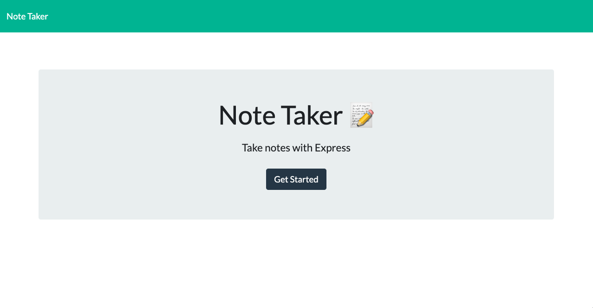
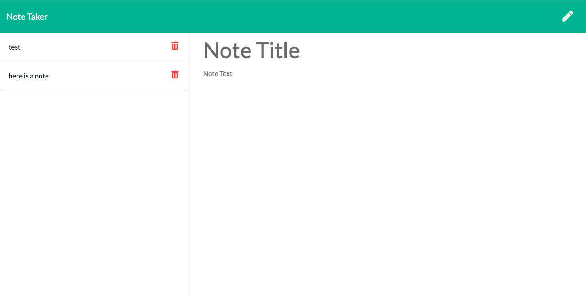
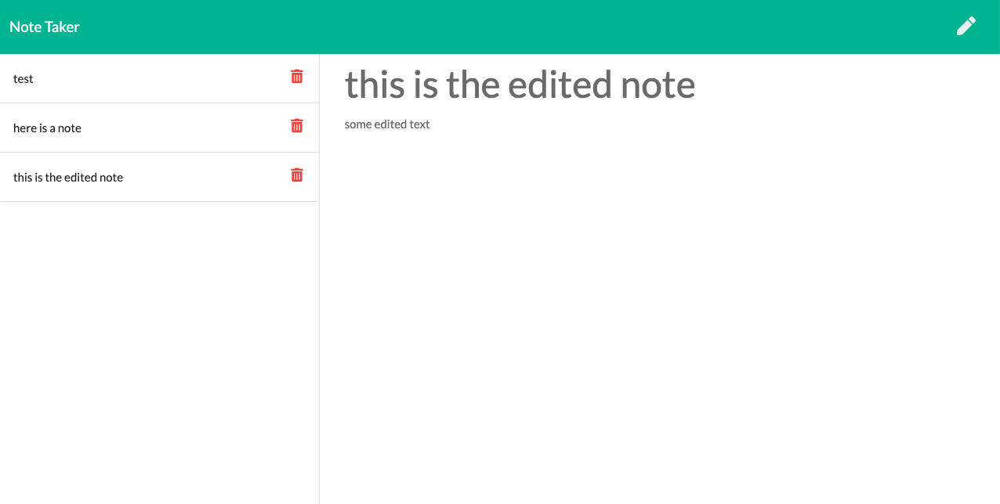
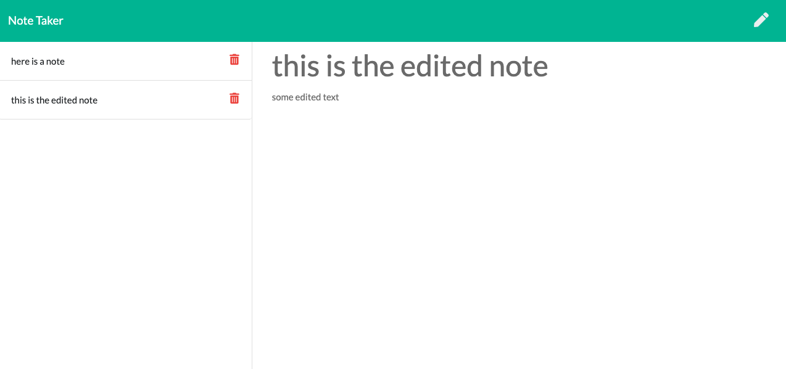

# Note Taker with Express

## Application Overview
When this application is completed it will allow users to input notes, review saved notes stored in a database, return data from user request, and allow the notes to be deleted as needed by the user from the database. 

## Contributors
Jahugawugasuga

### Technology 
Used Postman, Express, FS, for this project

## FutureDev
Edit note seems to be creating a new note, not editing the current one
add some stylings
upgrade to where it can be used as react component
